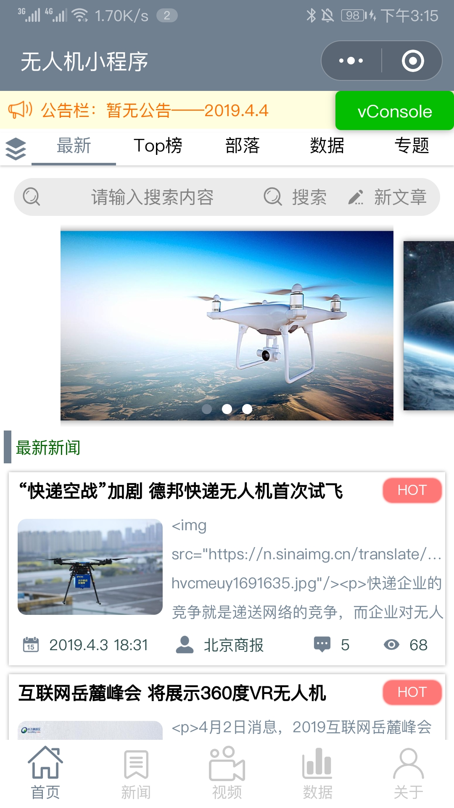
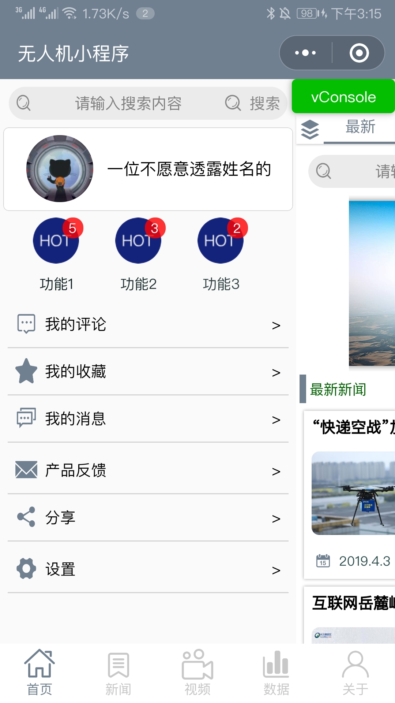

# 无人机新闻小程序

## 设计目标
* 提供一个可以进行无人机相关新闻浏览，视频观看，直播观看，数据查询以及用户互动的小程序。
* 在后台搭建服务器接口，能够通过wx.request请求获取服务器数据
## 开发环境
* 前端：**mpvue**
    > https://github.com/Meituan-Dianping/mpvue

    > 基于 Vue.js 的小程序开发框架，从底层支持 Vue.js 语法和构建工具体系。
* 后端：**Django**
* 数据库：**mysql**
* 其他；**腾讯官方提供小程序云开发**

## 界面设计
**1. 主界面**
* 顶部公告栏，可以由系统管理员发送一些通知
* 标签切换，含有多个不同标签
* 搜索框，输入文字可以搜索相关信息，还有发送文章按钮，可以自己写文章
* 滚动图片
* 文章列表，视频列表 

**2. 新闻界面**
* 新闻专栏按钮
* 文章列表

**3. 视频界面**
* 视频专栏按钮
* 视频按钮

**4. 数据界面**
* 会议等大型活动数据查询
* 无人机具体机器参数数据查询

**5. 关于界面**
* 头像昵称，登录信息
* 各种其他功能

**6. 侧边栏**
* 功能与关于界面相同，只不过在主界面可以左侧滑出

**7. 搜索界面**
* 显示历史搜索
* 当前热搜词
* 搜索结果

**8. 文章视频详情界面**
* 标题，日期，作者评论数据信息
* 主体内容
* 评论功能
* 热评功能

**9. 数据详情界面**
* 显示无人机图片
* 名称，参数，价格，优缺点等等信息

## 功能设计
**1. 前端代码**

**2. 获取数据**

**3. 其他**
* **mpvue-wxParse**
    > 适用于 Mpvue 的微信小程序富文本解析组件

## 后台开发
**1. 云开发**
* 在没有备案过的域名，服务器或者ssl证书的情况下使用云开发做后台非常合适
* 可以直接从云开发数据库调用信息
* 也可以通过node.js云函数调用

**2. Django**
* python语言的后端框架

**3. Apache**
* 将Django部署到Apache上
* 服务器：Ubuntu Server 18.04

## demo

